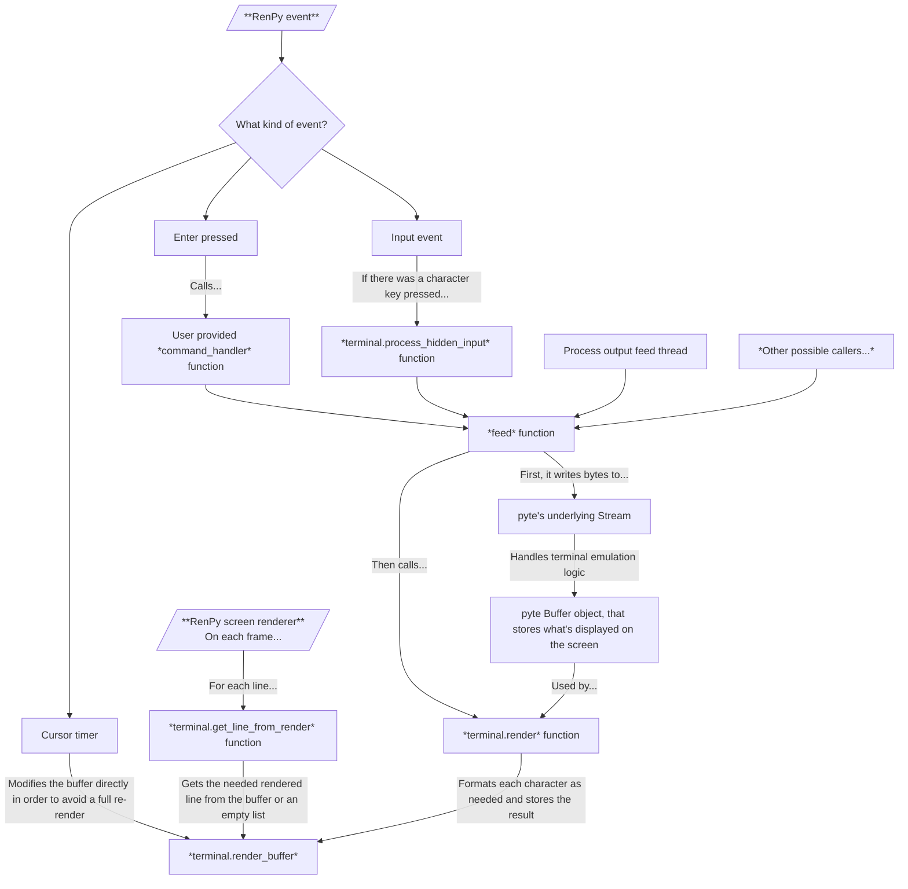

# Backend Architecture

The `RenPyTerminal` class is what glues `pyte` and RenPy together. It derives the `pyte.HistoryScreen` class.

If you want to draw something on the screen (or change the screen somehow), you should figure out a way to do that using the `feed` function, since that what it was meant for.

## TL;DR: What is this?

It's just the code that handles the quirks of the RenPy world and the `pyte` terminal emulator world.

## Rendering pipeline

## See also

  - [`pyte` documentation](https://pyte.readthedocs.io/en/latest/)
  - [`pyte.Screen` API reference](https://pyte.readthedocs.io/en/latest/api.html#pyte-screens-screen) (you're going to need it, trust me)
  - [`pyte.HistoryScreen` API reference](https://pyte.readthedocs.io/en/latest/api.html#pyte-screens-historyscreen)