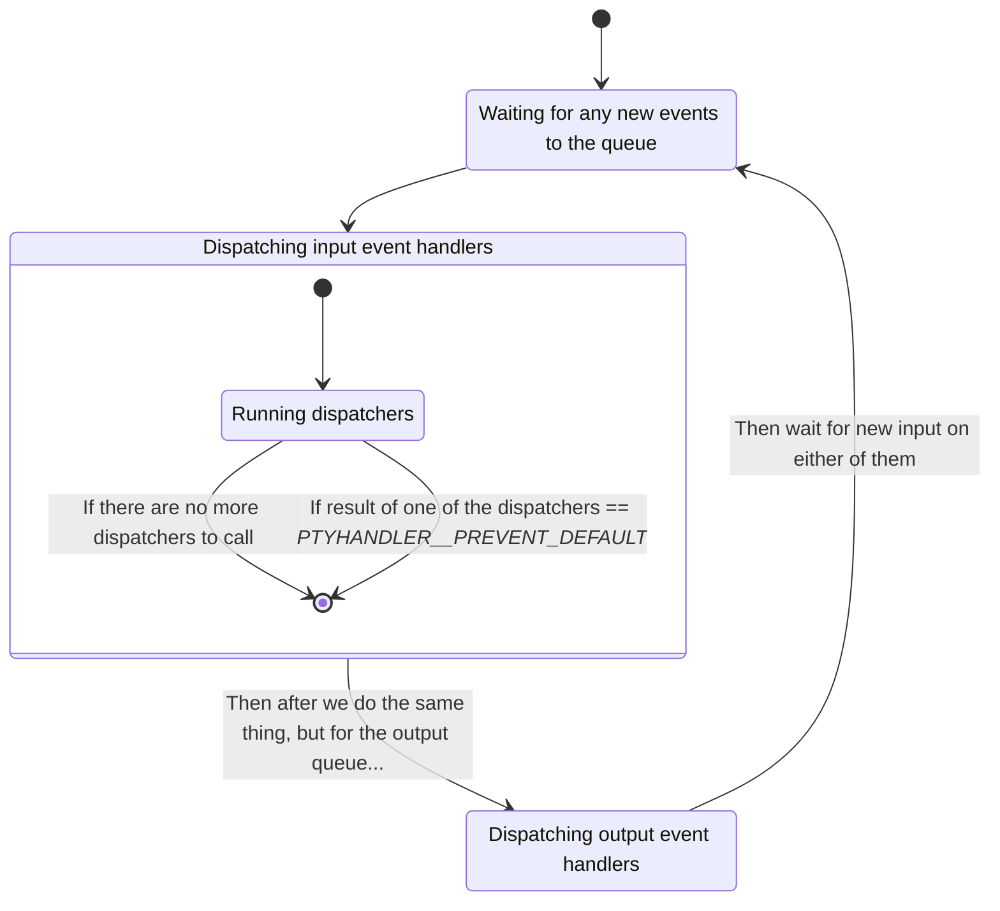
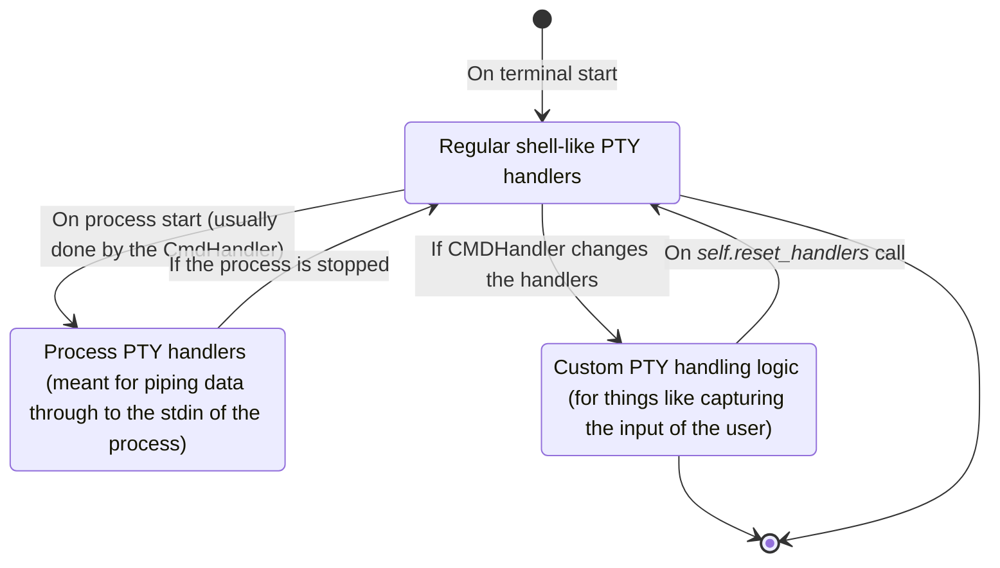
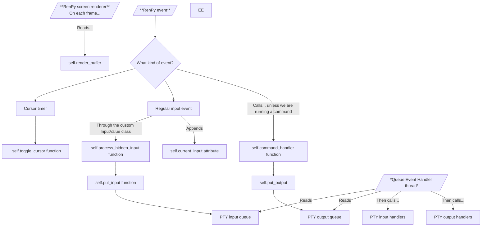

# Backend Architecture

The `RenPyTerminal` class is what glues `pyte` and RenPy together. It derives the `pyte.HistoryScreen` class.

If you want to draw something on the screen (or change the screen somehow), you should figure out a way to do that using the `put_output` function.

## TL;DR: What is this?

It's just the code that handles the quirks of the RenPy world and the `pyte` terminal emulator world. Also this code handles managing the state machine for different 

## PTY events

PTY event queues or PTY queues - are two input and output queues that pass the data through to the event queue handling thread (from now on -- EQHT).
From there, the EQHT dispatches the input handlers and output handlers accordingly.

This approach allows deep customization of how the terminal handles different types of input at any given time.

They are split like that because that is how real terminals handle input as well. As for the programs, they have three standard channels:

  - `stdin` - handles user input
  - `stdout` - handles general output
  - `stderr` - handles output of error messages and stuff like that

The event queue handling thread dispatches .  

### EQHT state diagram

```mermaid

stateDiagram-v2
    w: Waiting for any new events to the queue
    dih: Dispatching input event handlers
    doh: Dispatching output event handlers
    state dih {
        rd_i: Running dispatchers
        [*] --> rd_i
        rd_i --> [*]: If there are no more dispatchers to call
        rd_i --> [*]: If result of one of the dispatchers == _PTYHANDLER__PREVENT_DEFAULT_
    }

    [*] --> w
    w --> dih
    dih --> doh: Then after we do the same thing, but for the output queue...
    doh --> w: Then wait for new input on either of them
```

### PTY Handler state diagram

This state diagram represents the usual flow of changing the input and output PTY handlers.

```mermaid
stateDiagram-v2
    rph: Regular shell-like PTY handlers
    pph: Process PTY handlers (meant for piping data through to the stdin of the process)
    cph: Custom PTY handling logic (for things like capturing the input of the user)
    [*] --> rph: On terminal start
    rph --> pph: On process start (usually done by the CmdHandler)
    pph --> rph: If the process is stopped
    rph --> cph: If CMDHandler changes the handlers
    cph --> rph: On *self.reset_handlers* call
    cph --> [*]
    rph --> [*]
```

## Rendering pipeline (in a nutshell)

This applies if we are in Regular PTY handling flow. *WIP*.

```mermaid
flowchart TD;
    R[/**RenPy screen renderer**
      On each frame... /] -->|Reads...| RBuff[self.render_buffer];

    Re[/**RenPy event**/]-->EC{What kind of event?};
    EC-->CT[Cursor timer];
    EC-->IE[Regular input event];
    EC-->|Calls... unless we are running a command | cmdHandler[self.command_handler function];

    CT-->TC[_self.toggle_cursor function]

    EE  
    cmdHandler --> po[self.put_output]
    po --> out_q[PTY output queue]

    IE -->|Through the custom InputValue class| phi[self.process_hidden_input function]
    IE -->|Appends| curinp[self.current_input attribute]
    phi --> pi[self.put_input function]
    pi --> in_q[PTY input queue]

    q_t -->|Reads| in_q
    q_t -->|Reads| out_q
    q_t[/*Queue Event Handler thread*/] -->|Then calls...| in_q_h[PTY input handlers]
    q_t[/*Queue Event Handler thread*/] -->|Then calls...| out_q_h[PTY output handlers]

```

## See also

  - [`pyte` documentation](https://pyte.readthedocs.io/en/latest/)
  - [`pyte.Screen` API reference](https://pyte.readthedocs.io/en/latest/api.html#pyte-screens-screen) (you're going to need it, trust me)
  - [`pyte.HistoryScreen` API reference](https://pyte.readthedocs.io/en/latest/api.html#pyte-screens-historyscreen)