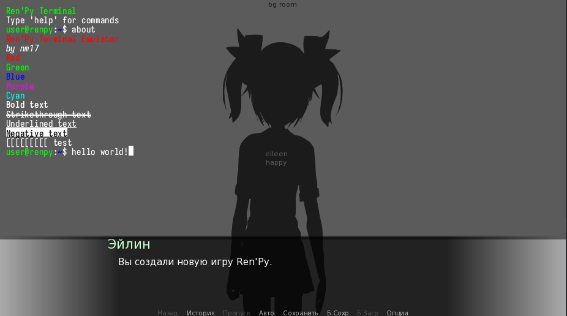
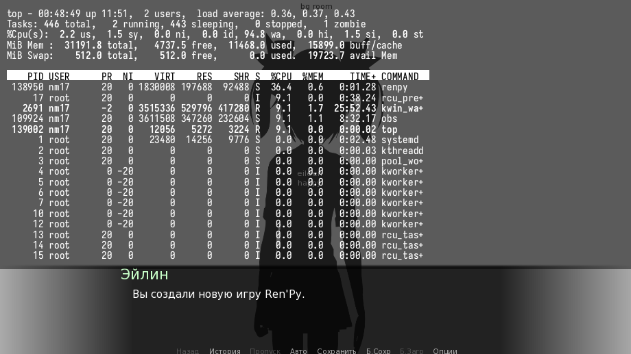

# Gallery

**Please note:** the following screenshots are from the previous version before the text render buffer rewrite. Now adding background for individual characters is not supported due to a limitation within how RenPy handles a lot of `frame` UI objects at once. 

